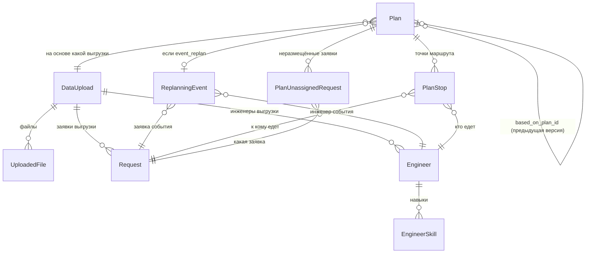

# DATABASE.md

Что хранится в БД и зачем — модели `src/core/db/models/`. Про слои/стиль кода
см. [../agents-docs/ARCHITECTURE.md](../agents-docs/ARCHITECTURE.md)/
[../agents-docs/CODE_STYLE.md](../agents-docs/CODE_STYLE.md). Что и почему в
терминах ТЗ — [../../docs/source_files/TECHNICAL_CONSTRAINTS.md](../../docs/source_files/TECHNICAL_CONSTRAINTS.md).

## Модели БД (`src/core/db/models/`)

| Файл | Класс | Хранит |
|---|---|---|
| `request.py` | `Request` | Заявка — как пришла из выгрузки (адрес, окно, норматив, требуемый навык/транспорт). Сырые данные, без состояния плана. |
| `engineer.py` | `Engineer` | Инженер/бригада — старт, смена, транспорт, округ. |
| `engineer_skill.py` | `EngineerSkill` | Связь инженер ↔ навык (1–3 строки на инженера). |
| `data_upload.py` | `DataUpload` | Факт одной загрузки данных диспетчером — по одному округу за раз. |
| `uploaded_file.py` | `UploadedFile` | Оригинальный xlsx-файл в S3, привязан к выгрузке. |
| `replanning_event.py` | `ReplanningEvent` | Внештатное событие (авария/отмена/недоступность инженера), запустившее перепланирование. |
| `plan.py` | `Plan` | Одна версия распределения заявок по инженерам для округа — «шапка» плана. |
| `plan_stop.py` | `PlanStop` | Одна назначенная остановка маршрута внутри конкретного `Plan`. |
| `plan_unassigned_request.py` | `PlanUnassignedRequest` | Заявка, которую план не смог разместить ни у одного инженера, и причина. |

Общие enum'ы — `src/core/db/enums.py` (не модели, переиспользуемые типы колонок).

---

## Три слоя моделей

```
1. Сырые данные:        Request, Engineer, EngineerSkill
2. Откуда они взялись:   DataUpload, UploadedFile
3. Что с ними решил алгоритм: ReplanningEvent → Plan → PlanStop
```

Модели слоя 1 не знают о планировании вообще — это просто то, что лежало в
экселе. Слой 2 отвечает только на вопрос «откуда эта строка взялась и где
скачать оригинал файла». Слой 3 — единственное место, где живёт результат
работы алгоритма; `Request`/`Engineer` при перепланировании **не
меняются**, меняется только то, какой `Plan` считается текущим.



---

## Слой 1 — сырые данные (кратко, детали в докстрингах моделей)

`Request` и `Engineer` — просто зеркало входного экселя плюс нормализованные
поля, которые нужны алгоритму (`norm_minutes`, `required_skill` и т.п., см.
докстринг `Request`). `EngineerSkill` — отдельная таблица вместо массива в
колонке, чтобы у инженера было 1–3 строки-навыка с нормальным FK, а не
денормализованный список.

## Слой 2 — выгрузка

**`DataUpload`** — не хранит сами данные, только факт «диспетчер загрузил
данные по округу X в момент Y» (`id`, `region`, `created_at`). `Request` и
`Engineer` ссылаются на неё через `upload_id` — так видно, из какой именно
загрузки взялась конкретная строка.

Диспетчер может разом загрузить все три округа или только один — на бэке
это всегда N независимых `DataUpload`, потому что округа не пересекаются
(свой пул инженеров и заявок). «Текущая выгрузка округа» — не отдельный
флаг в БД, а просто **последняя по `created_at` строка `DataUpload` с этим
`region`**; «предыдущая» — предпоследняя.

**`UploadedFile`** — сам присланный xlsx (лежит в S3, тут только ссылка):
`upload_id`, `s3_bucket`/`s3_key`, `filename`, `content_type`. На одну
выгрузку обычно 2 файла (заявки + инженеры), поэтому связь
один-ко-многим.

## Слой 3 — результат планирования

### `ReplanningEvent` — что случилось

Строка создаётся **только** для третьего сценария (внештатная ситуация).
Обычное нажатие кнопки «пересчитать» без новых данных никакого события не
создаёт — там `Plan.triggered_by_event_id` остаётся пустым.

- `event_type` — `urgent_request` (пришла срочная/аварийная заявка) /
  `request_cancelled` (клиент отказался или бригада не может выполнить) /
  `engineer_unavailable` (сломалась машина, инженеру стало плохо и т.п.).
- `request_id` / `engineer_id` — ровно одно из двух заполнено, в
  зависимости от `event_type`: для `urgent_request` и `request_cancelled` —
  `request_id` (у срочной заявки это уже созданный `Request` с
  `upload_id = null`, потому что он появился не из файла, а из события); для
  `engineer_unavailable` — `engineer_id`.
- `occurred_at` — когда событие произошло по факту (не когда его записали
  в систему — это `created_at`).

### `Plan` — «шапка» одной версии распределения

Один `Plan` = один результат работы алгоритма для одного округа на момент
времени. Он **не хранит маршруты напрямую** — маршруты это `PlanStop` (см.
ниже), `Plan` хранит только контекст и агрегаты:

| Поле | Что значит |
|---|---|
| `region` | какой округ (округа планируются независимо). |
| `upload_id` | на данных какой выгрузки посчитан план. Для `initial` — свежая выгрузка; для `manual_replan`/`event_replan` обычно та же выгрузка, что и у предыдущего плана округа (новых файлов не грузили). |
| `kind` | `initial` (первичное планирование по утренней выгрузке) / `manual_replan` (диспетчер нажал «пересчитать» без новых данных) / `event_replan` (пересчёт из-за `ReplanningEvent`). |
| `based_on_plan_id` | ссылка на план, из которого этот получен (self-FK). Нужна, чтобы построить диф «было/стало»: берём `PlanStop` плана-предка и `PlanStop` этого плана, сравниваем по `request_id`. |
| `triggered_by_event_id` | заполнено только у `kind = event_replan` — какое конкретно событие вызвало пересчёт. |
| `is_baseline` | `true` — план посчитан простым базовым алгоритмом «по порядку поступления» (обязателен по ТЗ для сравнения метрик), `false` — результат нормальной оптимизации. На одной и той же выгрузке может существовать пара планов: baseline и оптимизированный. |
| `total_mileage_km`, `engineers_used_count` | обязательные метрики плана целиком: суммарный пробег и число задействованных инженеров. |

«Какой план сейчас актуален для округа» — опять же не флаг, а последний
`Plan` по `created_at` с этим `region` (и `is_baseline = false`, если нужен
именно рабочий план, а не baseline для сравнения).

### `PlanStop` — маршрутный лист одного инженера

Смотри на `Plan` как на «результат планирования на день для округа», а на
`PlanStop` — как на **одну строчку в расписании одного конкретного
инженера**: «инженер такой-то едет к заявке такой-то, вот во столько-то».

У одного `Plan` таких строк много — по несколько на каждого инженера,
задействованного в этом плане. Если взять все `PlanStop` одного плана,
отфильтровать по одному `engineer_id` и отсортировать по `sequence_number`
— получится ровно маршрут этого инженера на день: куда он едет первым,
куда вторым, и т.д.

Пример. Пусть в плане инженер Иванов едет на 3 заявки. В таблице
`PlanStop` это будет 3 отдельные строки:

| id | plan_id | engineer_id | request_id | sequence_number | planned_arrival | planned_start | planned_finish | travel_minutes | distance_km | is_locked |
|---|---|---|---|---|---|---|---|---|---|---|
| … | план дня | Иванов | заявка A | 1 | 09:15 | 09:15 | 10:05 | 12 | 3.4 | false |
| … | план дня | Иванов | заявка B | 2 | 10:50 | 11:00 | 12:30 | 20 | 7.1 | false |
| … | план дня | Иванов | заявка C | 3 | 14:30 | 14:30 | 15:20 | 15 | 5.0 | false |

Расшифровка полей:

- **`sequence_number`** — порядковый номер остановки в маршруте **именно
  этого инженера в этом плане** (не сквозная нумерация по всем инженерам).
  1 = первая точка, куда он едет после старта, 2 = вторая, и т.д. Именно по
  этому полю восстанавливается порядок объезда для карты/списка.
- **`planned_arrival`** — расчётное время физического приезда инженера на
  точку.
- **`planned_start`** — расчётное время **начала работы**:
  `max(planned_arrival, Request.window_start)` — начать раньше окна
  заявки нельзя, но приехать раньше и ждать можно (заявка B в примере выше:
  приехал в 10:50, окно открывается в 11:00 — 10 минут ждёт). Диспетчеру на
  UI показывается именно это поле, не сырой `planned_arrival` (см.
  `docs/PLANS_API.md`).
- **`planned_finish`** — `planned_start + Request.norm_minutes_without_travel`.
- **`travel_minutes`** / **`distance_km`** — сколько ехать и сколько
  километров от предыдущей точки маршрута (для первой точки — от стартовой
  точки инженера) до этой.

Все три временных поля и `travel_minutes`/`distance_km` — заморожены на
момент построения плана (не пересчитываются на лету), хотя формула
`planned_start`/`planned_finish` детерминирована и зависит только от уже
сохранённых значений — так же, как и для `travel_minutes`/`distance_km`,
это то самое решение алгоритма на момент построения именно этого `Plan`,
а не то, что можно было бы получить, пересчитав по текущим данным позже.
- **`is_locked`** — эта остановка перенесена из предыдущего плана
  **без изменений**, потому что на момент перепланирования её время уже
  в прошлом (инженер уже выехал или уже там). Актуально для
  `manual_replan`: то, что уже случилось, не трогаем и не пересчитываем —
  пересчитываем только то, что ещё впереди по времени.

Одна заявка = максимум одна строка `PlanStop` в рамках одного плана (это
закреплено `UniqueConstraint`), и у инженера не может быть двух остановок с
одинаковым `sequence_number` в одном плане — тоже constraint, не только
договорённость.

### `PlanUnassignedRequest` — заявки, которые план не смог разместить

Заявка без `PlanStop` в этом плане — не назначена. Но просто «нет строки» —
недостаточно: по ТЗ (§3) сервис обязан явно показать диспетчеру причину
понятным языком. Поэтому на каждую такую заявку — отдельная строка здесь:
`plan_id`, `request_id`, `reason`.

`reason` — закрытый enum `UnassignedReason` (`src/core/db/enums.py`), ровно
по формулировкам ТЗ:

| Значение | Когда |
|---|---|
| `no_matching_skill` | ни у одного инженера округа нет нужного навыка. |
| `no_matching_vehicle` | у заявки задан обязательный транспорт, и ни у кого его нет. |
| `no_time_slot` | подходящий по навыку/транспорту инженер есть, но заявка не влезает ни в чью смену/окно. |
| `no_available_engineer` | всё совпадает, но все подходящие инженеры на это время уже заняты другими заявками. |

**Почему это отдельная таблица, а не просто «посчитать на лету при
отображении»**: причина зависит от времени в пути, которое динамическое
(реальный маршрут/пробки) — то же самое соображение, из-за которого
`PlanStop` хранит `travel_minutes`/`distance_km` как замороженные значения,
а не пересчитывает их каждый раз. Если бы мы считали причину по запросу
вместо хранения, при повторном пересчёте позже днём для той же заявки
можно было бы получить другой ответ (время в пути изменилось — заявка,
которая утром не влезала в окно, вечером вдруг «влезает»), и diспетчер
увидел бы не то решение, которое реально принял алгоритм. Храним —
значит показываем всегда то же самое, что видел алгоритм в момент
построения именно этого `Plan`.

Уникальность `(plan_id, request_id)` — заявка не может быть неразмещена
дважды в одном плане (и не может одновременно быть в `PlanStop` и здесь —
это не проверяется constraint'ом на уровне БД, следит сервисный слой).
