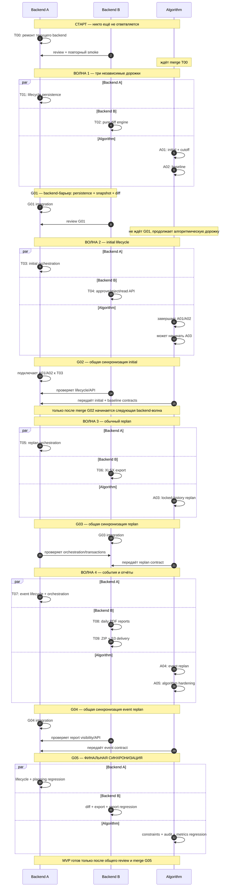

# Схема выполнения по трём дорожкам

## Как читать схему

- время идёт сверху вниз;
- блок `par` означает одновременную работу;
- `G01` синхронизирует только двух backend-разработчиков — Algorithm в этот момент не
  останавливается;
- `G02`, `G03`, `G04` принимают результат соответствующего этапа Algorithm, после чего
  backend может переходить к следующей функциональной волне;
- `G05` — финальная синхронизация всех трёх дорожек.

## Основная схема без плагинов

Эта версия читается прямо в редакторе как обычный текст. Время идёт сверху вниз.

```text
BACKEND A                    BACKEND B                    ALGORITHM
    |                            |                            |
    +-------- T00: FIX CURRENT BACKEND ----------------------+
    |       выполняет            | review + smoke            | ждёт
    +----------------------------+----------------------------+
                                 |
======================= ВОЛНА 1: ПАРАЛЛЕЛЬНО =========================
    |                            |                            |
    | T01                       | T02                        | A01
    | lifecycle persistence     | pure diff engine           | initial + cutoff
    |                            |                            |
    |                            |                            | A02
    |                            |                            | baseline
    |                            |                            |
    +========== G01: BACKEND SYNC ==========+                | продолжает
    | persistence + snapshot + diff         |                | без ожидания
    +----------------------------------------+                |
                                 |                            |
======================= ВОЛНА 2: ПАРАЛЛЕЛЬНО =========================
    |                            |                            |
    | T03                       | T04                        | завершает A01/A02
    | initial orchestration     | approve/reject/read API    | начинает A03
    |                            |                            |
    +===================== G02: INITIAL SYNC =================+
    |       Backend A + Backend B + Algorithm A01/A02         |
    |       initial полностью работает end-to-end             |
    +----------------------------+----------------------------+
                                 |
======================= ВОЛНА 3: ПАРАЛЛЕЛЬНО =========================
    |                            |                            |
    | T05                       | T06                        | A03
    | replan orchestration      | plan XLSX export           | replan algorithm
    |                            |                            |
    +===================== G03: REPLAN SYNC ==================+
    |       Backend A + Backend B + Algorithm A03             |
    |       replan + locked history + diff работают E2E       |
    +----------------------------+----------------------------+
                                 |
======================= ВОЛНА 4: ПАРАЛЛЕЛЬНО =========================
    |                            |                            |
    | T07                       | T08                        | A04
    | event backend             | daily PDF reports          | event algorithm
    |                            |        |                   |        |
    |                            |        v                   |        v
    |                            | T09                        | A05
    |                            | ZIP + S3 delivery          | hardening
    |                            |                            |
    +===================== G04: EVENT SYNC ===================+
    |       Backend A + Backend B + Algorithm A04             |
    |       event lifecycle полностью работает E2E            |
    +----------------------------+----------------------------+
                                 |
    +===================== G05: FINAL SYNC ===================+
    | Backend A: planning regression                          |
    | Backend B: diff/export/report regression                |
    | Algorithm: constraints/audit/metrics regression         |
    +---------------------------------------------------------+
                                 |
                            MVP ГОТОВ
```

Коротко о точках ожидания:

```text
T00  -> обязателен для всех трёх дорожек
G01  -> ждут только Backend A и Backend B; Algorithm не останавливается
G02  -> backend ждёт готовые A01 + A02
G03  -> backend ждёт готовую A03
G04  -> backend ждёт готовую A04
G05  -> ждёт все backend-задачи, T09 и A05
```

## Mermaid-версия для совместимых просмотрщиков

Следующая диаграмма необязательна. Если IDE не поддерживает Mermaid, ориентироваться нужно
на ASCII-схему выше и таблицу ниже.



## Та же схема в таблице

| Этап | Backend A | Backend B | Algorithm | Условие перехода |
|---|---|---|---|---|
| Старт | Выполняет `T00` | Ревьюит и повторяет smoke | Ждёт | `T00` в общей ветке |
| Волна 1 | `T01` persistence | `T02` diff | `A01 → A02` | Backend-задачи независимы; Algorithm полностью отдельно |
| `G01` | Интегрирует | Ревьюит | Продолжает без остановки | T01+T02 совместимы, backend DTO зафиксированы |
| Волна 2 | `T03` initial | `T04` decisions/read | Заканчивает A01/A02, начинает A03 | Три параллельных потока |
| `G02` | Интегрирует initial | Проверяет lifecycle | Передаёт A01/A02 | Полный initial E2E работает |
| Волна 3 | `T05` replan backend | `T06` XLSX | `A03` replan | Три параллельных потока |
| `G03` | Ревьюит orchestration | Интегрирует | Передаёт A03 | Полный replan E2E работает |
| Волна 4 | `T07` events backend | `T08 → T09` reports/export | `A04 → A05` | Три параллельных потока; внутри каждой дорожки свой порядок |
| `G04` | Интегрирует events | Проверяет API/report visibility | Передаёт A04 | Event lifecycle работает E2E |
| `G05` | Planning regression | Export/report regression | Algorithm regression | Совместное review, весь MVP готов |

## Где люди действительно могут работать параллельно

### После T00

Все три человека работают независимо. Backend A не трогает diff-модуль, Backend B не
трогает ORM/миграции, Algorithm не зависит от целевой lifecycle-схемы.

### После G01

Backend A работает в домене `planning`, Backend B — в `plans`. Algorithm продолжает свои
чистые контракты. Общая точка — только заранее зафиксированные DTO.

### После G02

Backend A пишет orchestration replan, Backend B формирует XLSX из готового snapshot,
Algorithm реализует вычисление replan. Ни одна ветка не должна копировать работу другой.

### После G03

Backend A реализует события, Backend B — report pipeline, Algorithm — применение событий.
Report renderer может строиться до готовности событий на абстрактном approved report
snapshot; видимость approved events проверяется в G04/G05.

## Где параллельность запрещена

1. До T00 нельзя начинать ни одну дорожку: иначе ветки наследуют сломанную схему.
2. T03/T04 нельзя начинать до G01: иначе появятся два несовместимых Plan DTO.
3. T05/T06 нельзя начинать до G02: semantics current/approve ещё не зафиксирована.
4. T07/T08 нельзя начинать до G03: полный snapshot и replan history ещё не доказаны.
5. Нельзя объявлять MVP готовым после G04: ещё нужны T09, A05 и общий G05.

## Правило интеграционного барьера

Барьер — отдельный PR, а не устная договорённость. Он закрыт, когда:

1. все входящие задачи уже слиты;
2. временные adapters удалены;
3. контракт проверен end-to-end;
4. второй backend-разработчик выполнил review;
5. владелец Algorithm подтвердил корректность алгоритмического адаптера, если барьер
   принимает результат его дорожки;
6. `make check` проходит;
7. следующая волна ответвляется от merge commit барьера.
