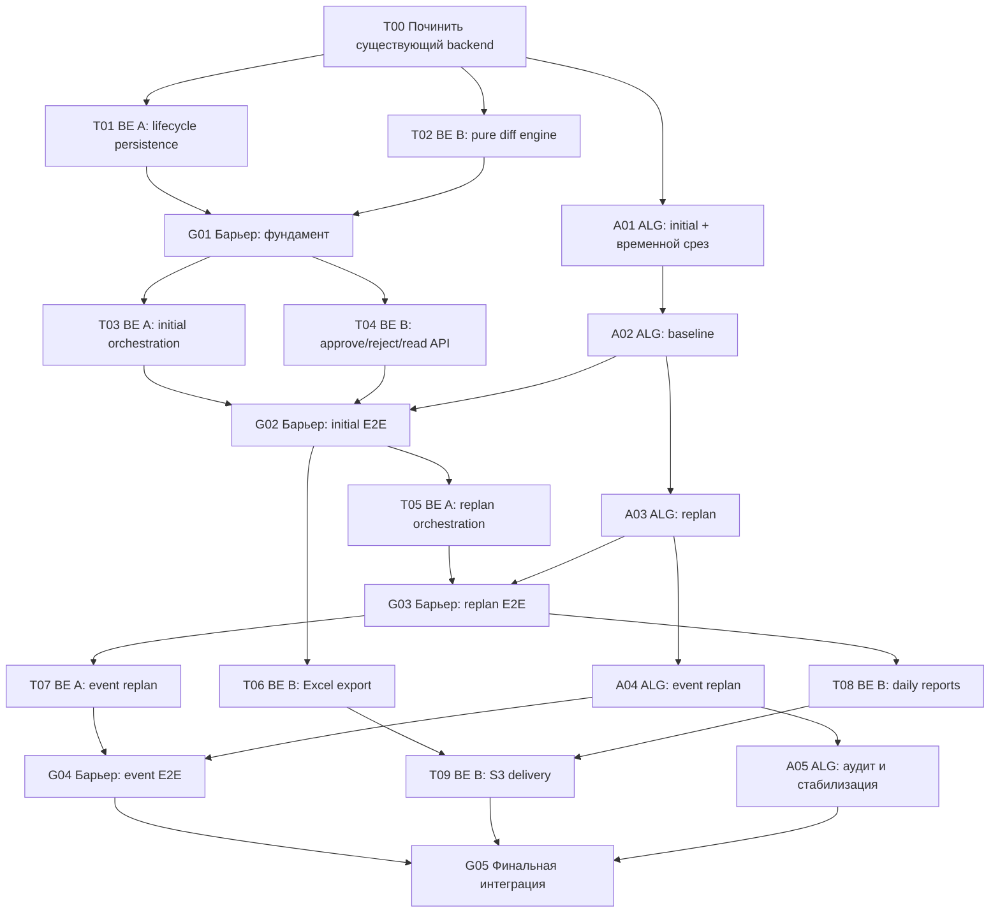

# План реализации lifecycle планирования

## 1. Назначение

Этот каталог разбивает реализацию согласованного user case на атомарные задачи для трёх
разработчиков:

- **Backend A** — основная orchestration/data-дорожка;
- **Backend B** — lifecycle/read/export-дорожка;
- **Algorithm** — отдельная алгоритмическая подсистема, которую реализует владелец
  алгоритма.

Канонические требования находятся в `../user-case/`. При расхождении формулировок задача
не расширяет user case: применяется `FULL_USER_CASE.md`, затем профильный документ
`BACKEND.md` или `ALGORITHM.md`.

## 2. Главный принцип распараллеливания

После `T00` алгоритмическая дорожка не зависит от backend-задач. Она последовательно
реализует чистые алгоритмические контракты. Backend работает двумя параллельными ветками и
периодически проходит через интеграционные барьеры.

Нельзя начинать волну после барьера, пока сам барьер не закрыт в общей ветке. Это защищает
команду от параллельной работы поверх несовместимых моделей и API.

Отдельная наглядная swimlane-схема с тремя дорожками и временной осью находится в
[`EXECUTION_SCHEME.md`](./EXECUTION_SCHEME.md). Она является основной схемой распределения
людей; диаграмма ниже показывает зависимости самих задач.

## 3. Волны и загрузка людей

| Волна | Backend A | Backend B | Algorithm |
|---|---|---|---|
| 0 | `T00` совместно/один исполнитель | ревью `T00` | ждёт закрытия `T00` |
| 1 | `T01` | `T02` | `A01`, затем `A02` |
| Барьер 1 | `G01`, второй backend делает ревью | ревью/исправления | продолжает свою дорожку |
| 2 | `T03` | `T04` | продолжает `A01–A03` |
| Барьер 2 | `G02` | ревью/исправления | предоставляет `A01+A02` |
| 3 | `T05` | `T06` | `A03` |
| Барьер 3 | ревью/исправления | `G03` | предоставляет `A03` |
| 4 | `T07` | `T08`, затем `T09` | `A04`, затем `A05` |
| Барьер 4 | `G04` | ревью/исправления | предоставляет `A04` |
| Финал | `G05`, часть A | `G05`, часть B | предоставляет `A05`, проверяет алгоритм |

На интеграционном барьере один backend-разработчик вносит изменения, второй ревьюит и
проверяет сценарии. Следующую волну нельзя начинать в обход барьера.

## 4. Реестр задач

### Старт

- [`T00`](./T00_FIX_CURRENT_BACKEND.md) — **выполнена**: восстановлено гарантированно
  рабочее текущее состояние.

### Фундамент

- [`T01`](./T01_PLAN_LIFECYCLE_PERSISTENCE.md) — целевая модель и persistence lifecycle.
- [`T02`](./T02_PLAN_DIFF_ENGINE.md) — чистый вычисляемый дифф без БД и HTTP.
- [`G01`](./G01_FOUNDATION_INTEGRATION.md) — слить persistence, read DTO и diff.

### Initial

- [`T03`](./T03_INITIAL_ORCHESTRATION.md) — pending initial и независимые результаты округов.
- [`T04`](./T04_PLAN_DECISION_AND_READ_API.md) — approve/reject/current/history/detail.
- [`A01`](./A01_ALGORITHM_INITIAL.md) — initial с единым cutoff и аудитом результата.
- [`A02`](./A02_ALGORITHM_BASELINE.md) — отдельный baseline.
- [`G02`](./G02_INITIAL_E2E.md) — собрать initial от загрузки до решения диспетчера.

### Replan

- [`T05`](./T05_REPLAN_ORCHESTRATION.md) — backend orchestration обычного replan.
- [`T06`](./T06_PLAN_XLSX_EXPORT.md) — Excel любого плана.
- [`A03`](./A03_ALGORITHM_REPLAN.md) — locked history и пересчёт будущего хвоста.
- [`G03`](./G03_REPLAN_E2E.md) — собрать replan и вычисляемый дифф.

### Event replan и отчёты

- [`T07`](./T07_EVENT_REPLAN_BACKEND.md) — lifecycle события и атомарный event replan.
- [`T08`](./T08_DAILY_REPORTS.md) — PDF округа и общий summary.
- [`T09`](./T09_EXPORT_S3_DELIVERY.md) — ZIP и временная выдача через S3.
- [`A04`](./A04_ALGORITHM_EVENT_REPLAN.md) — четыре типа событий.
- [`G04`](./G04_EVENT_E2E.md) — собрать event replan end-to-end.

### Завершение

- [`A05`](./A05_ALGORITHM_HARDENING.md) — алгоритмический аудит, метрики и стабильность.
- [`G05`](./G05_RELEASE_HARDENING.md) — полный regression user case и готовность к сдаче.

## 5. Общие правила выполнения задач

1. Одна задача — одна рабочая ветка и один PR.
2. Исполнитель не меняет файлы, закреплённые за параллельной задачей, без явной
   синхронизации.
3. Интеграционные задачи выполняются только после слияния всех входящих задач.
4. `make check` обязателен перед передачей задачи на ревью.
5. Тестовая инфраструктура сейчас отсутствует. Нельзя тихо добавлять `pytest` или новые
   зависимости; сценарии задачи фиксируются как smoke/integration checks до отдельного
   решения команды.
6. Миграции не переписывают существующие данные разрушительным способом и не применяются
   к внешним средам без отдельного разрешения.
7. `AGENTS.md` и `agents-docs/*` не изменяются. Если после реализации устарел
   `PROJECT_CONTEXT.md`, об этом сообщают владельцу проекта, который обновляет его вручную.
8. Future functionality из `../user-case/FUTURE_FUNCTIONALITY.md` не попадает в задачи
   MVP, кроме явно описанного конфигурируемого fallback для initial validity.

## 6. Условие полной готовности

Работа считается завершённой только после `G05`. Завершение отдельной дорожки не означает
готовность продукта: должны совместно работать initial, approve/reject, replan, event
replan, diff, Excel, отчёты, S3-доставка, partial success и конкурентные проверки.
